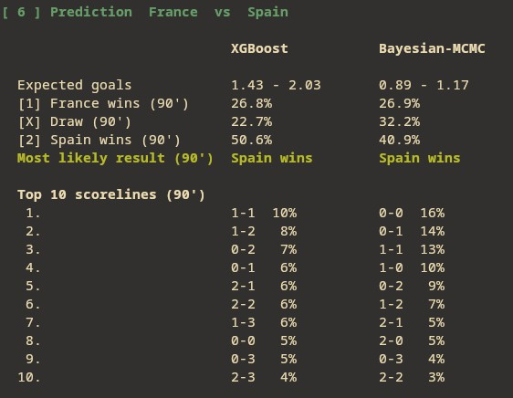

# World Cup 2026 Predictor

<p align="center">
  
</p>

**WC26 Predictor** is a personal Machine Learning project focused on predicting international matches, with a special emphasis on the *FIFA World Cup 2026*.

Using the [**international_results**](https://github.com/martj42/international_results) dataset, the system estimates each national team's offensive and defensive strength through a Dixon-Coles model. With those estimates, two expected-goals approaches are trained:

- A Bayesian MCMC model (PyMC + NUTS)
- An XGBoost Tweedie regression

Expected goals are converted into a joint scoreline matrix using **Negative Binomial distributions**. The resulting matrix is used to compute the final 1X2 probabilities. The terminal UI lets you compare both models side by side.

## Requirements

- Linux, macOS or Windows with a terminal
- [Miniconda](https://docs.conda.io/en/latest/miniconda.html)
- git (with submodule support)

## Installing Miniconda

If you do not have Conda yet, install Miniconda by following the instructions provided on the [official documentation](https://www.anaconda.com/docs/getting-started/miniconda/system-requirements)  according to your operating system.

On Linux, after completing the installation, restart your terminal or run:

```bash
source ~/.bashrc
```

This will reload your shell configuration and make the `conda` command available.

## Cloning the repository

The match dataset resides on a git submodule:

```bash
git clone --recurse-submodules https://github.com/Chigga21/fifa26-predictor.git
cd fifa26-predictor
```

### Initializing the submodule (if you already cloned without it)

```bash
git submodule update --init --recursive
```

### Updating the submodule later

To pull the latest matches from the upstream dataset:

```bash
git submodule update --remote data/external/international_results
```

## Creating and activating the Conda environment

From the project root, create the environment from `environment.yml` and activate it:

```bash
conda env create -f environment.yml
conda activate fifa26
```

## Running the project

With the `fifa26` environment active, launch the interactive terminal UI:

```bash
python fifa26/main.py
```

You will see the ASCII logo, the startup menu, arrow-key team selection and the 1X2 forecast for both models.

Disable ANSI colours if your terminal does not support them:

```bash
NO_COLOR=1 python fifa26/main.py
```

> [!IMPORTANT]
> **This project was developed for educational and research purposes.**  Although the model may produce interesting predictions, it is not recommended for use in betting, since no model can predict football's inherent uncertainty.

<table align="center">
  <tr>
    <td align="center">
      
    </td>
    <td width="10"></td>
    <td align="center">
      
    </td>
  </tr>
</table>

That said, the program has personally produced accurate results on a few occasions. This should be considered anecdotal and not a reliable statistical basis.

## Project structure

```
fifa26-predictor/
├── environment.yml          
├── fifa26/
│   ├── main.py              
│   ├── domain.py            
│   ├── data.py              
│   ├── models/
│   │   ├── dixon_coles.py   
│   │   ├── goals.py        
│   │   └── score_matrix.py  
│   ├── pipeline/
│   │   ├── training.py      
│   │   └── predictor.py     
│   └── cli/
│       ├── ansi.py          
│       ├── menu.py          
│       ├── indicator.py     
│       ├── plots.py         
│       └── app.py           
├── scripts/                 
├── tests/                                      
├── static/                  
└── data/external/           
```

## Testing

The project ships an automated test suite you can run with:

```bash
pytest -v
```

